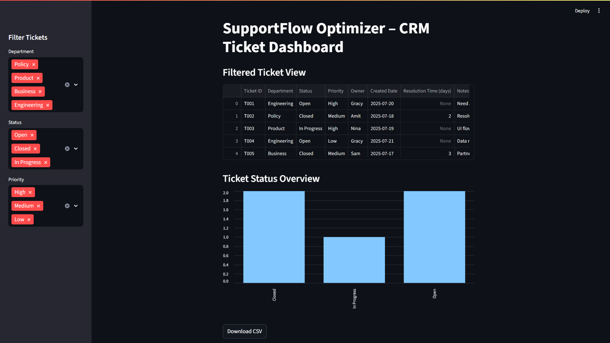

# SupportFlow Optimizer – CRM Workflow Dashboard

This is a Streamlit-based dashboard app that simulates CRM-style partner support workflows.

### Features
- Filter tickets by Department, Status, and Priority
- Live table view with real-time filtering
- Bar chart showing ticket status distribution
- Download filtered results as CSV

### Stack Used
- Python
- Streamlit
- Pandas

### Screenshot

### Run Locally